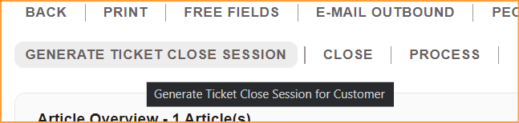
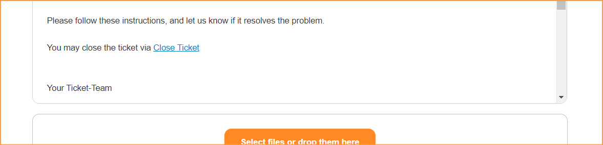
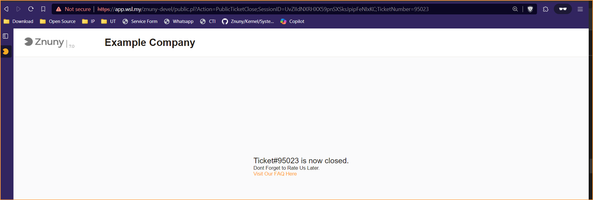

# Znuny-Customer-Ticket-Close
- Allow customer to close their ticket via one-time link (public portal) provided by the agent reply
- This way, they can close the ticket from email without need to login.

One time link to be attached at reply template

	https://<OTRS_CONFIG_FQDN>/<OTRS_CONFIG_ScriptAlias>public.pl?Action=PublicTicketClose;SessionID=<OTRS_TICKET_DynamicField_CustomerSession>;TicketNumber=<OTRS_TICKET_TicketNumber>

**You may want to turn off SessionCheckRemoteIP
  
    
1) Ticket owner generated temp session id using 'GENERATE TICKET CLOSE SESSION' ticket zoom menu.  
  
  
  
2) Agent append specific url (for customer to close the ticket) in their reponse.  
  
  
  
4) Customer click the link. Upon ticket closed, the url will be no longer accessable and invalid.

